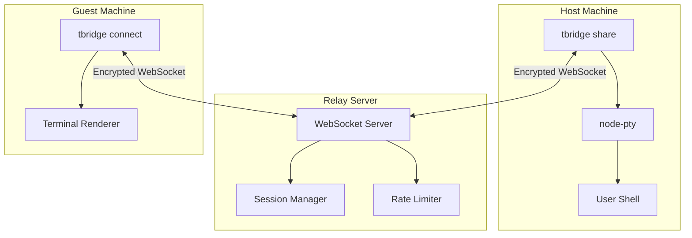
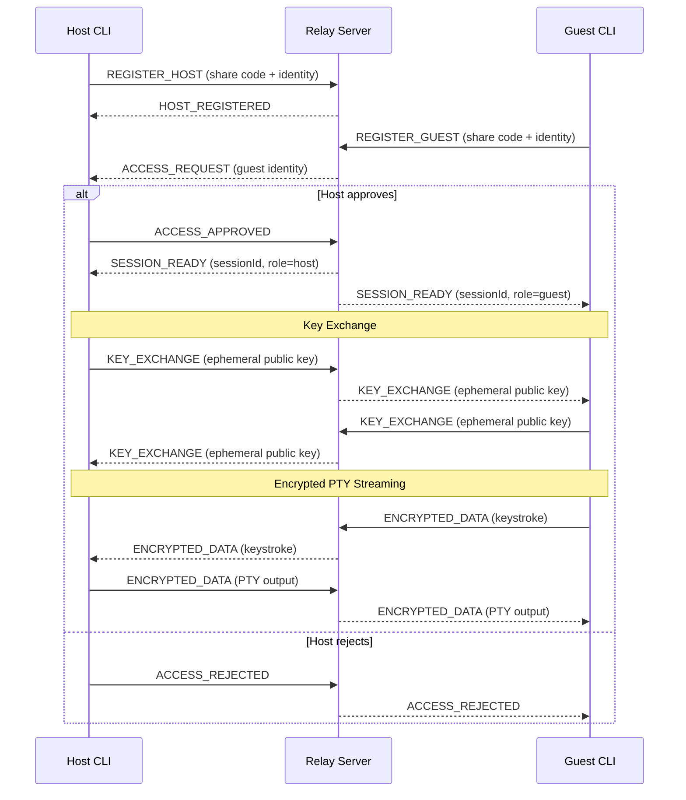
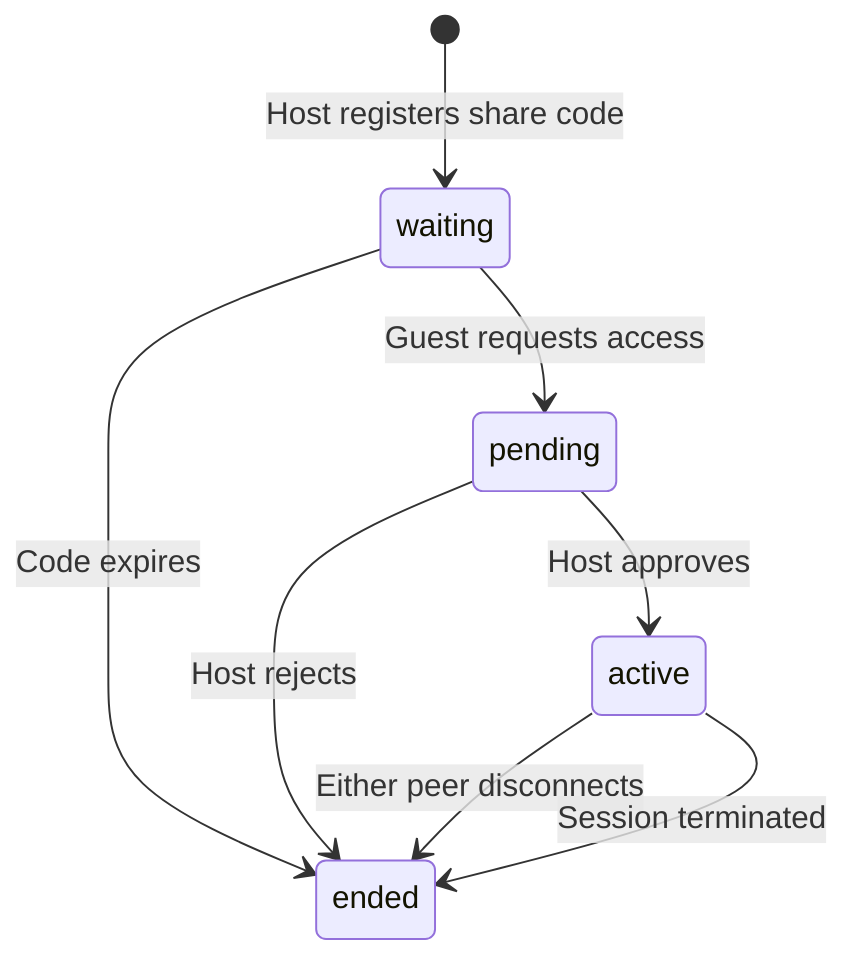
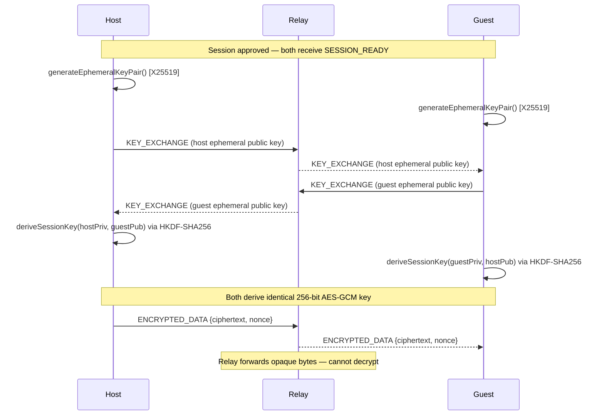

# T-Bridge

**Secure terminal sharing over encrypted relay.**

T-Bridge is a CLI tool for sharing interactive terminal sessions between two machines over a WebSocket relay. The host retains full control — every session requires explicit approval, all PTY traffic is end-to-end encrypted, and the relay server is architecturally unable to read terminal content.

Built as a TypeScript monorepo. No agents, no daemons, no persistent access.

---

## Why T-Bridge Exists

Sharing a terminal with another person is a solved problem in theory and a security incident in practice.

**SSH access sharing** typically means handing out credentials, forwarding ports, or granting shell access to a machine you may not fully control. Revoking that access later is manual, error-prone, and often forgotten.

**Screen-sharing tools** solve visibility but not interactivity. Typing into someone else's terminal through a video call is slow, lossy, and frustrating.

**Existing terminal sharing tools** often skip encryption, lack explicit consent flows, or treat the relay as a trusted intermediary that can inspect traffic.

T-Bridge takes a different approach:

- The **host must approve** every session before any PTY access is granted.
- Terminal traffic is **end-to-end encrypted** — the relay cannot read keystrokes or output.
- Sessions are **short-lived and single-use** — share codes expire and are consumed on use.
- The relay **coordinates and routes**, but never executes commands or stores terminal content.

### Intended Use Cases

| Scenario | How T-Bridge helps |
|---|---|
| **Pair debugging** | Share your terminal with a colleague to debug a failing deploy together. |
| **Mentorship** | Give a junior engineer interactive access to walk through a production config. |
| **Incident response** | Grant a teammate temporary shell access to a staging box during an outage. |
| **Secure support** | Let a vendor debug your environment without giving them SSH keys. |
| **Collaborative access** | Work through a complex migration with someone typing alongside you. |

---

## Key Features

- **Host-approved sessions** — no shell is spawned until the host explicitly accepts.
- **End-to-end encryption** — X25519 key exchange + AES-256-GCM. The relay sees only opaque ciphertext.
- **Local device identity** — Ed25519 keypairs per device, stored in OS keychain when available.
- **Local permissions** — trusted, blocked, and manual-approval user policies.
- **Live PTY streaming** — output streams chunk-by-chunk as produced, not after command completion.
- **Short-lived share codes** — single-use, time-limited, bound to the host device.
- **Reconnect with grace period** — dropped connections attempt recovery with exponential backoff.
- **Rate limiting** — per-IP sliding-window limits on connections, registrations, and message throughput.
- **Structured logging** — JSON-formatted server logs for session lifecycle events.
- **Zero external runtime dependencies** — encryption uses Node.js built-in `crypto`, no libsodium required.

---

## Architecture Overview

T-Bridge is a three-component system: a **host CLI** that owns the shell, a **guest CLI** that renders remote output, and a **relay server** that routes encrypted messages between them.

### System Architecture



### Session Lifecycle



### Session State Machine



---

## Security Model

T-Bridge exposes remote shell access. Security is part of the core design, not an afterthought.

### Trust Boundaries

| Boundary | Guarantee |
|---|---|
| **Relay blindness** | The relay routes opaque `ENCRYPTED_DATA` messages. It cannot decrypt PTY keystrokes or output. |
| **No shell on relay** | The relay server never spawns processes, executes commands, or accesses a PTY. |
| **No content storage** | Terminal input, output, passwords, and environment variables are never persisted by the relay. |
| **Host-side approval** | A PTY is only spawned after the host explicitly approves the incoming session request. |
| **Single-use codes** | Share codes are consumed on session activation and cannot be reused. |

### Encryption

| Layer | Primitive | Purpose |
|---|---|---|
| Key exchange | X25519 ECDH | Ephemeral per-session key agreement |
| Key derivation | HKDF-SHA256 | Derive 256-bit AES key from shared secret |
| Transport encryption | AES-256-GCM | Authenticated encryption of all PTY traffic |
| Nonce management | Monotonic counter + sender prefix | Replay protection via strictly-increasing nonces |
| Identity signing | Ed25519 | Local device identity and public key distribution |

### Approval Flow

1. Guest sends an `ACCESS_REQUEST` with their public identity metadata.
2. Host sees the requester's user ID, device name, and public key.
3. Host chooses to **approve** or **reject**. Local policy may auto-decide for trusted or blocked users.
4. Only after approval does the host spawn a PTY and begin the encryption handshake.

### What T-Bridge Does Not Guarantee

> **This is experimental software.** The following limitations apply:

- No formal cryptographic audit has been performed.
- The current prototype does not implement signed handshakes — key exchange messages are forwarded through the relay without signature verification. A compromised relay could theoretically perform a MITM attack during key exchange.
- Replay protection uses monotonic nonce counters per direction, but does not yet include session-binding or timestamp-based expiry.
- Local policy enforcement is host-side only. The relay does not enforce access control beyond basic rate limiting.
- Private keys stored via file fallback (when OS keychain is unavailable) are protected with `0o600` permissions but not encrypted at rest.

---

## CLI Usage

```
tbridge login                    Create or load local device identity
tbridge identity                 Print public identity metadata
tbridge logout                   Remove local device identity

tbridge share                    Share your terminal (generates a share code)
tbridge connect <code>           Connect to a shared terminal as guest

tbridge allow <user-id>          Mark a user as trusted (auto-approve)
tbridge deny <user-id>           Block a user (auto-reject)
tbridge forget <user-id>         Remove a user's policy override
tbridge policy                   Print local policy file
```

### Sharing a Terminal

```bash
$ tbridge share
T-Bridge relay: ws://127.0.0.1:8787
Share code: 842-193
Waiting for a guest to connect...

# Guest requests access
Guest "alice" (work-laptop) is requesting access.
Approve? [y/N] y

Session active. Ctrl+] to terminate.
```

### Connecting as Guest

```bash
$ tbridge connect 842-193
Connecting to ws://127.0.0.1:8787...
Requesting access...
Session active. You are now connected to the host terminal.
```

---

## Quick Start

### Prerequisites

- Node.js ≥ 20
- npm (ships with Node.js)

### Install and Build

```bash
git clone https://github.com/your-org/t-bridge.git
cd t-bridge
npm install
npm run build
```

### 1. Start the Relay

```bash
npm run dev:relay
```

The relay listens on `ws://127.0.0.1:8787` by default. Configure with `PORT` and `HOST` environment variables.

### 2. Create a Device Identity

```bash
tbridge login --user alice --device-name work-laptop
tbridge identity
```

### 3. Share Your Terminal

In a second terminal:

```bash
npm run dev:share
```

Note the share code printed to stdout.

### 4. Connect as Guest

In a third terminal:

```bash
npm run dev:connect
```

Approve the session on the host side. PTY output streams immediately.

---

## Local Permissions

Host-side policy is stored at `~/.tbridge/policy.json` and supports three access modes:

| Mode | Behavior |
|---|---|
| `trusted` | Auto-approved while the host is actively sharing. |
| `blocked` | Auto-rejected immediately. No prompt shown. |
| `ask` (default) | Interactive approval prompt for each session request. |

### Managing Permissions

```bash
# Trust a user for future sessions
tbridge allow dev-guest

# Block a user permanently
tbridge deny unknown-user

# Remove a policy override (reverts to manual approval)
tbridge forget dev-guest

# View current policy
tbridge policy
```

### Policy File Format

```json
{
  "defaultPolicy": "ask",
  "trustedUsers": {
    "user_123": {
      "access": "interactive",
      "requireApproval": false,
      "expiresAt": null
    }
  },
  "blockedUsers": ["user_456"]
}
```

Policy evaluation follows a strict order: **blocked → trusted → ask**. The host always retains the ability to terminate any active session.

---

## Identity System

Each T-Bridge installation creates a local device identity on first login.

### Identity Contents

| Field | Description |
|---|---|
| `userId` | User identifier (from `--user` flag, `$USER` env, or `local-user` default) |
| `deviceId` | Random UUID generated per device |
| `deviceName` | Human-readable name (defaults to `hostname-platform`) |
| `publicKey` | Ed25519 public key (PEM/SPKI) |
| `privateKey` | Ed25519 private key (PEM/PKCS8) |

### Key Storage

Private keys are stored using the OS-native credential store when available:

| Platform | Backend | Mechanism |
|---|---|---|
| macOS | Keychain | `security add-generic-password` |
| Linux | Secret Service | `secret-tool store` (libsecret) |
| Windows | Credential Manager | `cmdkey` + PowerShell |
| Fallback | Local file | `~/.tbridge/identity.json` with `0o600` permissions |

When the OS keychain is used, the identity file on disk contains an empty `privateKey` field. The key is loaded from the credential store at runtime.

---

## Encryption Flow

End-to-end encryption is established after session approval, before any PTY data is exchanged.



### Nonce Construction

Each `SessionCipher` maintains a monotonic counter. Nonces are 12 bytes:

```
┌───────────────┬─────────────────────────┐
│ Sender ID     │ Counter (big-endian)    │
│ 4 bytes       │ 8 bytes                 │
└───────────────┴─────────────────────────┘
```

- Host uses sender ID `0x00000001`, guest uses `0x00000002`.
- The counter increments on every encrypted message.
- The receiver rejects any nonce with a counter ≤ the last received counter (replay protection).

---

## Reconnect and Reliability

### Reconnect Behavior

If a WebSocket connection drops during an active session:

1. The relay holds the session for a **30-second grace period** (configurable via `RECONNECT_GRACE_MS`).
2. The disconnected peer attempts reconnect with **exponential backoff**: 1s → 2s → 4s.
3. On successful reconnect, the relay sends `RECONNECT_OK` and the session resumes.
4. If the grace period expires without reconnect, the session is cleaned up and the peer is notified.

### Streaming Guarantees

- PTY output is forwarded **chunk-by-chunk** as produced by the host shell. There is no command-level buffering.
- Guest keystrokes are forwarded immediately to the host PTY.
- Interactive programs (vim, top, htop, node REPL) work correctly — stdin, stdout, resize, and control signals are all event streams.
- Backpressure: if the WebSocket send buffer grows too large, PTY reads are paused to prevent memory exhaustion.

### Rate Limits

| Limiter | Threshold | Window |
|---|---|---|
| WebSocket connections | 10 per IP | 60 seconds |
| Host/guest registrations | 5 per IP | 60 seconds |
| Messages (PTY flood protection) | 200 per IP | 1 second |

---

## Development Roadmap

| Phase | Status | Focus |
|---|---|---|
| **Phase 0** — Planning | ✅ Complete | Architecture, security model, Graphify workflow, scope definition |
| **Phase 1** — Local PTY | ✅ Complete | `node-pty` spawn, stdin/stdout streaming, resize handling |
| **Phase 2** — Relay Prototype | ✅ Complete | WebSocket relay, session rooms, JSON protocol, host approval |
| **Phase 3** — Pairing & Approval | ✅ Complete | Short-lived codes, TTL expiry, session state machine, clean disconnect |
| **Phase 4** — Local Permissions | ✅ Complete | `policy.json`, trusted/blocked/ask modes, CLI commands |
| **Phase 5** — Identity | ✅ Complete | Ed25519 keypairs, device registration, OS keychain integration |
| **Phase 6** — Hardening | ✅ Complete | E2E encryption (X25519 + AES-256-GCM), rate limiting, reconnect, structured logging, test suites |

### What's Left Before Production

- Server-backed authentication (replace local-only identity).
- Signed key exchange handshake (MITM protection).
- Device revocation at the relay layer.
- Persistent session metadata in PostgreSQL.
- Binary protocol framing (replace JSON for PTY payloads).

---

## Testing

Tests are written with [Vitest](https://vitest.dev/) and organized by component:

```bash
npm test
```

| Suite | Coverage |
|---|---|
| `tests/protocol/` | Message codec encode/decode, session state machine transitions |
| `tests/security/` | X25519 key exchange, AES-256-GCM encrypt/decrypt, nonce replay rejection, identity store CRUD |
| `tests/server/` | Structured logger output format |
| `tests/cli/` | Platform shell detection, share code generation, local policy engine |

---

## Graphify Integration

T-Bridge uses [Graphify](https://github.com/your-org/graphify) as an **architecture memory layer** — a development-time knowledge graph that indexes the codebase and produces structured artifacts for architectural recall.

### What Graphify Does

Graphify analyzes source code, planning docs, protocol definitions, and security decisions to produce a queryable knowledge graph of the project. The output is a set of artifacts that make it possible to understand the codebase's structure, dependencies, and design relationships without reading every file.

| Artifact | Purpose |
|---|---|
| `graphify-out/graph.json` | Machine-readable knowledge graph (nodes + edges) |
| `graphify-out/graph.html` | Interactive force-directed visualization |
| `graphify-out/GRAPH_REPORT.md` | Human-readable architecture report with module breakdowns, dependency matrices, and data flow analysis |

### What the Graph Captures

The T-Bridge knowledge graph currently tracks **38 nodes** and **52 edges** across the monorepo:

- **Package boundaries** — `@t-bridge/protocol`, `@t-bridge/crypto`, `@t-bridge/cli`, `@t-bridge/server` and their dependency relationships.
- **Protocol surface** — `ClientMessage` variants, `ServerMessage` variants, codec functions, and wire format.
- **Session state machine** — state transitions (`waiting → pending → active → ended`), mutation points, and code consumption rules.
- **Security model relationships** — how approval flow, policy evaluation, rate limiting, and encryption connect to the session lifecycle.
- **Data flow hotspots** — the critical latency-sensitive paths for PTY I/O and the state mutation points in `SessionManager`.
- **Module dependency matrix** — which modules import which, down to individual exports.

### Why This Matters

In a project where the protocol, security model, and session lifecycle are deeply interdependent, having a structured graph of how these pieces connect reduces the cost of onboarding, debugging, and extending the system. The graph is especially useful when:

- A new contributor needs to understand which modules are affected by a protocol change.
- A security review requires tracing trust boundaries across package boundaries.
- An architectural decision needs to account for existing coupling between components.

### Running Graphify

```bash
# Generate the knowledge graph
graphify . --output graphify-out

# View the architecture report
cat graphify-out/GRAPH_REPORT.md
```

> Graphify is a **development-time tool only**. It is not part of the runtime path for terminal sessions. The relay, CLI, and crypto packages have no dependency on Graphify.

---

## Design Principles

**Least privilege.** The relay has the minimum capability needed to route messages. It cannot read terminal content, execute commands, or access host-side resources.

**Explicit consent.** No shell is spawned without the host's approval. There is no unattended access, no background daemon, no persistent connection.

**Relay transparency.** The relay's role is visible and auditable. It logs session lifecycle events (connect, approve, reject, disconnect) without logging terminal content.

**Encrypted by default.** All PTY traffic is encrypted end-to-end after session approval. The relay handles only opaque ciphertext.

**Protocol simplicity.** The wire protocol is a small set of discriminated union types shared between CLI and server. JSON framing for the prototype; binary framing planned for production.

**Local-first policy.** Trust and block decisions are stored on the host machine. The relay does not manage access control beyond rate limiting.

---

## Future Directions

These are ideas under consideration, not commitments:

- **Browser dashboard** — web UI for session monitoring and policy management.
- **Ephemeral sessions** — time-limited access that auto-terminates after a configurable duration.
- **Multi-user sessions** — multiple guests observing or interacting with a single host terminal.
- **View-only mode** — guests can watch terminal output without input capability.
- **Session replay metadata** — structured metadata about session events (no terminal content) for audit trails.
- **NAT traversal** — WebRTC DataChannel for direct peer-to-peer transport, with relay fallback.
- **QUIC transport** — lower-latency transport evaluation for high-throughput PTY streaming.
- **Command-by-command approval** — host approves individual commands before they execute.
- **Signed key exchange** — Ed25519-signed ephemeral keys to prevent relay MITM during handshake.
- **Local-first relay** — run the relay on the same machine or LAN for air-gapped environments.

---

## Repository Structure

```
t-bridge/
├── apps/
│   ├── cli/                    # @t-bridge/cli — terminal sharing CLI
│   │   └── src/
│   │       ├── main.ts         # Commander entry point
│   │       ├── identity/       # Device identity + OS keychain
│   │       ├── permissions/    # Local policy engine
│   │       ├── terminal/       # PTY spawn, host/guest flows
│   │       └── ui/             # CLI display components
│   └── server/                 # @t-bridge/server — WebSocket relay
│       └── src/
│           ├── main.ts         # HTTP + WebSocket entry
│           ├── session-manager.ts
│           ├── rate-limiter.ts
│           └── logger.ts
├── packages/
│   ├── protocol/               # @t-bridge/protocol — shared wire types + codec
│   └── crypto/                 # @t-bridge/crypto — X25519 + AES-256-GCM
├── tests/
│   ├── cli/                    # Platform, policy tests
│   ├── protocol/               # Codec, session manager tests
│   ├── security/               # Crypto, identity, rate limiter tests
│   └── server/                 # Logger tests
├── docs/                       # Architecture, security model, roadmap
├── graphify-out/               # Knowledge graph artifacts
└── scripts/                    # Build helpers
```

---

## Contributing

Contributions are welcome. Please open an issue before submitting large changes to discuss scope and approach.

```bash
# Install dependencies
npm install

# Run tests
npm test

# Type check all packages
npm run typecheck

# Build all packages
npm run build
```

---

## License

MIT

---

## Disclaimer

> **T-Bridge is experimental software.** It has not undergone a formal security audit. Do not use it to share terminals containing production credentials, secrets, or sensitive data without understanding the current limitations described in the [Security Model](#security-model) section. Use at your own risk.
